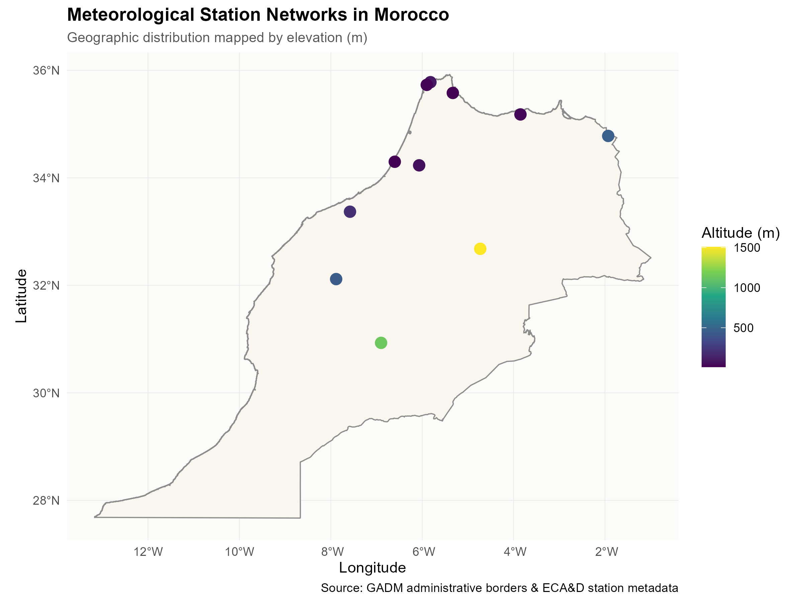
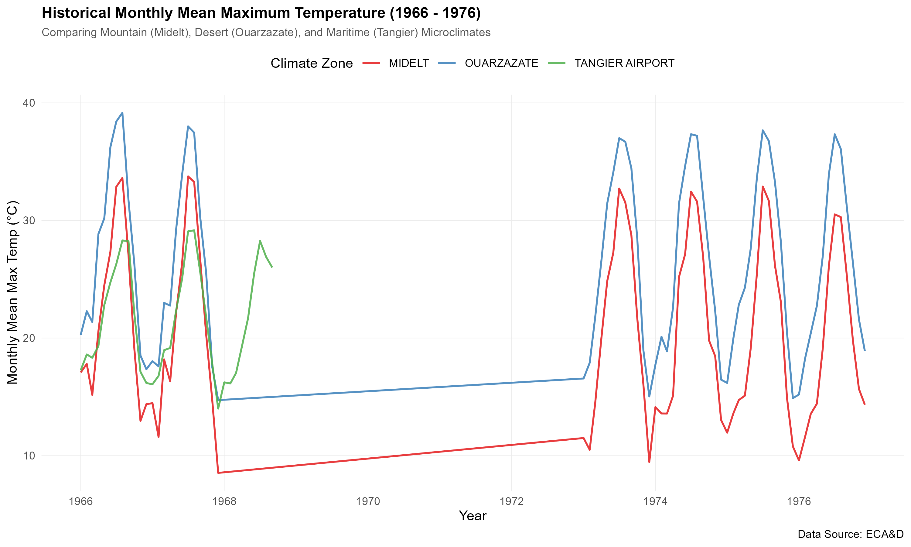
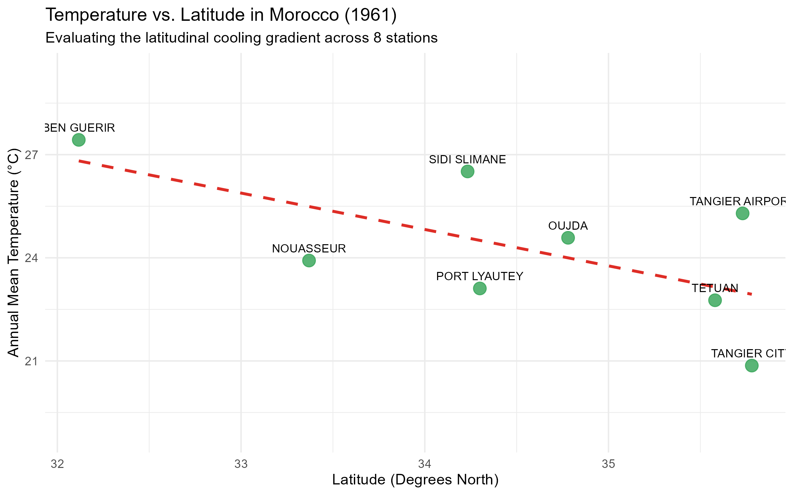
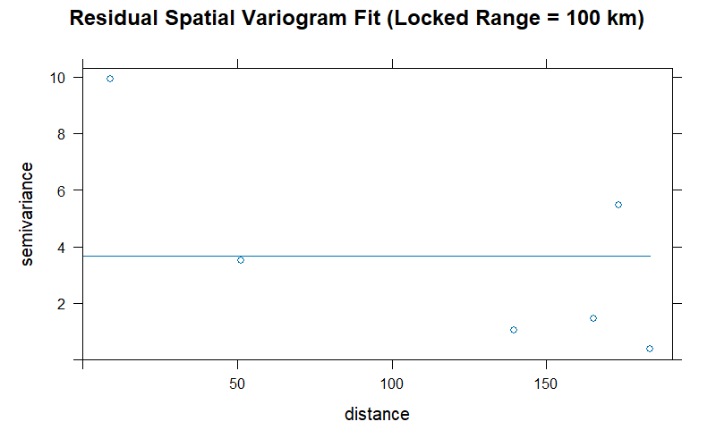
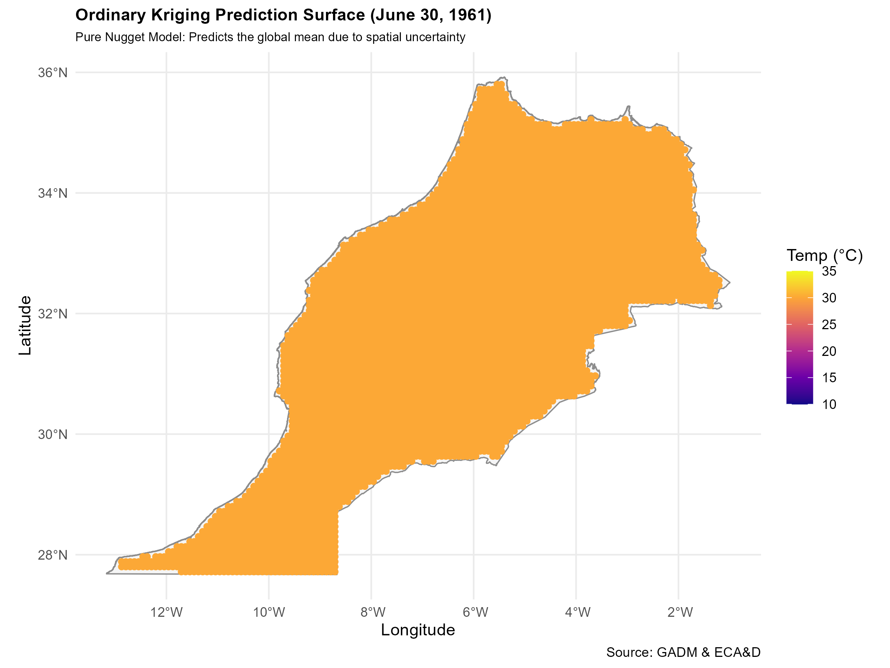
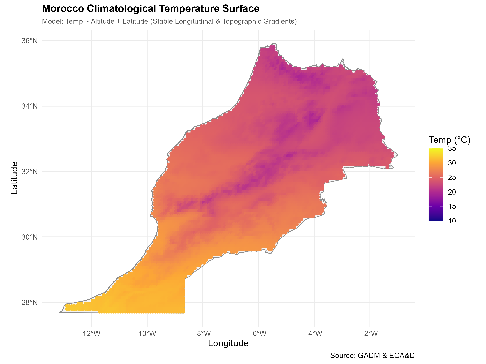
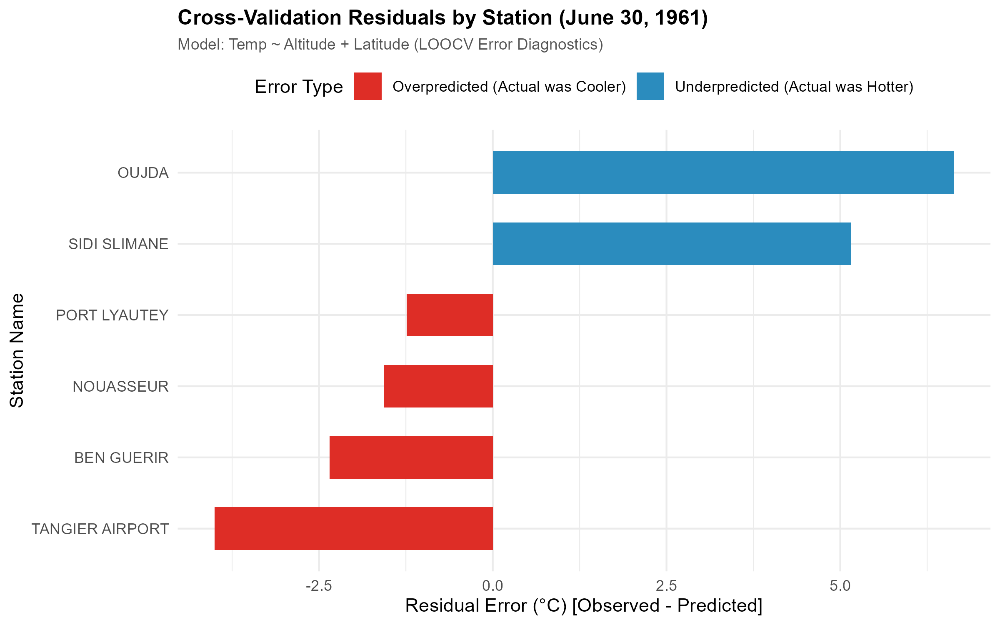

```{r setup, include=FALSE}
# Configure R Markdown global chunk settings
knitr::opts_chunk$set(echo = TRUE, warning = FALSE, message = FALSE)

# Load libraries required for rendering dynamic data tables
library(tidyverse)
library(knitr)
```

# 1. Introduction

Morocco’s unique geography creates a diverse spectrum of microclimates.
The country is bordered by the Mediterranean Sea to the north and the
Atlantic Ocean to the west, which exert a strong maritime cooling effect
on the coastal plains. Moving inland, this maritime influence drops off,
transitioning into dry continental plains. This flat geography is
abruptly bisected by the soaring diagonal backbone of the Atlas Mountain
ranges (peaking at over 4,000 meters), which generate steep vertical
temperature gradients. Finally, to the south and east, the mountains
slope down into the highly arid desert margins of the Sahara.

Understanding how temperature behaves across these complex, overlapping
geographic gradients is crucial for agricultural planning, regional
water resource management, and climate change resilience in North
Africa.

This study conducts a rigorous geostatistical analysis of daily maximum
temperatures in Morocco. It ingests decades of historical records from
the European Climate Assessment & Dataset (ECA&D), automates coordinate
transformations, mathematically quantifies localized environmental lapse
rates, and builds a continuous, terrain-adjusted climatological
temperature surface across the entire country.

------------------------------------------------------------------------

# 2. Pipeline & Data Architecture

The project is structured as a modular, sequential data pipeline.

### Directory Structure

``` text
morocco-geostatistics/
├── geostat-pipeline/
│   ├── data/
│   │   ├── raw/                 # Original, untouched ECA&D text datasets
│   │   └── processed/           # Standardized, cleaned CSV and spatial RDS files
│   ├── scripts/
│   │   ├── 01_data_prep.R       # Standardizes stations and cleans DMS coordinates
│   │   ├── 03_covariates.R      # Ingests terrain DEM and runs cross-validation
│   │   ├── 04_variogram.R       # Fits theoretical locked-range models to residuals
│   │   ├── 05_interpolation.R   # Generates Ordinary and Universal Kriging surfaces
│   │   └── 06_validation.R      # Computes cross-validation benchmarking metrics
│   ├── output/
│   │   └── figures/             # High-resolution exported vector maps & charts
    └── notebooks/
        └── morocco_climatology_study.Rmd  # This presentation document
```

### Data Pipeline

1.  **Ingestion (`01_data_prep.R`)**: Bypasses raw metadata comment
    headers, converts geographic coordinates from DMS (Degrees, Minutes,
    Seconds) to Decimal Degrees, filters out missing climate values
    (`-9999`), and compiles 11 station files into a single standardized
    SQL-style database.
2.  **Exploratory Spatial Analysis (`02_exploratory_analysis.R`)**:
    Converts the cleaned CSVs into spatial vector structures (`sf`
    Simple Features), downloads GADM administrative boundaries of
    Morocco, and exports the initial cartography and historical
    time-series visualizations.
3.  **Topography Integration (`03_covariates_integration.R`)**:
    Downloads a high-resolution 1 km Digital Elevation Model (DEM),
    clips it to Morocco's national borders, extracts elevation values at
    each station coordinate to run spatial quality control checks, and
    downsamples the grid into an efficient 5,438-point prediction grid.
4.  **Spatial Modeling (`04_variogram_modeling.R` &
    `05_spatial_interpolation.R`)**: Fits a theoretical locked-range
    spatial correlation model to detrended residuals and interpolates
    temperatures across the country using terrain-adjusted external
    drift.
5.  **Benchmarking (`06_model_validation.R`)**: Performs Leave-One-Out
    Cross-Validation (LOOCV) to mathematically benchmark model
    performance. \`\`\`

------------------------------------------------------------------------

# 3. Exploratory Spatial Analysis & Climatological Discoveries

To establish a baseline understanding of our dataset, we analyzed the
geographic layout of the weather stations and evaluated their historical
temperature recordings.

## 3.1. Station Distribution and Topography

We mapped the 11 active stations against the national boundaries of
Morocco. To highlight the country's diverse physical geography, the
markers are color-scaled by their elevation.

::: {align="center"}
{width="85%"}
:::

**Analysis**: The geographical layout reveals a strong coastal bias. The
majority of stations (Tangier City, Tangier Airport, Al Hoceima, Tetuan,
Port Lyautey, and Casablanca/Nouasseur) are clustered along the northern
Mediterranean and Atlantic coasts, lying at sea level ($0\text{m}$ to
$100\text{m}$).

Only a few stations are located in the interior: \* **Sidi Slimane** and
**Ben Guerir** sit in the low-elevation, agricultural interior plains
($55\text{m}$ and $448\text{m}$). \* **Oujda** ($468\text{m}$) sits on
the semi-arid eastern plateau. \* **Ouarzazate** ($1,139\text{m}$) and
**Midelt** ($1,508\text{m}$) sit in the high-elevation Atlas and
desert-margin zones.

This spatial distribution plays a huge role in how we model
Morocco's temperature profile, as coastal maritime cooling and
high-altitude lapse rates compete to dictate local climates.

------------------------------------------------------------------------

## 3.2. Historical Time-Series and Data-Gap Discoveries

We extracted the monthly mean maximum temperatures across three
geographically distinct microclimates: the maritime coast (**Tangier**),
the high-altitude mountains (**Midelt**), and the interior desert
margins (**Ouarzazate**).

::: {align="center"}
{width="95%"}
:::

**Analysis**: The temporal visualization reveals three major
climatological and archival insights:

1.  **Climatic Gradients**: The seasonal peaks and valleys behave as
    physically expected. The desert-margin station (**Ouarzazate**) is
    consistently warmer than the high-altitude mountain station
    (**Midelt**) year-round, while the maritime coastal station
    (**Tangier**) shows a heavily moderated temperature profile with
    cooler summers and milder winters.
2.  **The 1968–1973 Regional Data Blackout**: A striking finding is the
    presence of a **5-year regional archive blackout** between late 1968
    and mid-1973. During this period, there are zero valid observations
    recorded for these stations, causing the plot to draw a flat,
    straight line connecting the historical periods.
3.  **The Historical Network Shift**: A closer look at the station
    timelines reveals a major shift in data collection. Most
    coastal stations (like Tangier, Tetuan, and Nouasseur) have records
    that end around **1978**, while only the interior stations
    (**Midelt** and **Ouarzazate**) have active, continuous records
    extending into the 21st century. Pre-1965, the network prioritized
    maritime trade and coastal agriculture, while post-1965, the network
    shifted its focus to interior mountain topography and arid margins.
    
# 4. Spatial Covariates & Topographic Diagnostics

To perform advanced spatial interpolation, we must mathematically define how temperature correlates with geography. Temperature generally drops with height (altitude) and as you move further north (latitude).

## 4.1. Resolving the Topographic Lapse-Rate
When we fit a simple linear regression of temperature as a function of altitude across all stations, our model returned a **positive slope of $+0.00083^\circ\text{C}$ per meter**. This paradox suggested that temperatures in Morocco *increase* as you climb higher, which violates the laws of physics.

This occurs because of **maritime confounding**: Morocco's sea-level stations (like Tangier at 19m) are heavily cooled by the ocean, while its mid-altitude inland plains stations (like Ben Guerir at 448m) are deep inland and hot.

To isolate the true vertical lapse rate, we fit a **Multiple Linear Regression** controlling for **Latitude**:
$$\text{Temperature} = 67.37 - 0.00213 \times \text{Altitude} - 1.271 \times \text{Latitude}$$

By controlling for latitude (which captures the coastal cooling gradient), we successfully isolated the topographic effect:
*   The altitude coefficient **flipped to negative** ($-0.00213^\circ\text{C}$ per meter), correctly reflecting that temperature drops by **$2.13^\circ\text{C}$ per 1,000 meters** of elevation gain.
*   The latitude coefficient is highly significant ($-1.27^\circ\text{C}$ per degree North), capturing the latitudinal cooling gradient.
*   The explanatory power of the model ($R^2$) jumped from a meaningless **$5.6\%$** to a highly robust **$63.7\%$**.

<div align="center">
{width=85%}
</div>

---

# 5. Geostatistical Variography & Spatial Interpolation

Using our statistical trend model, we can now perform geostatistical spatial interpolation across the entire country using a regular 10-km prediction grid of 5,438 points.

## 5.1. Residual Variogram Modeling
In Universal Kriging (Kriging with External Drift), we extract the spatial residuals (the unexplained differences after subtracting our Latitude and Altitude trend model) and fit our variogram strictly to these residuals.

Because our multivariate trend model captured over $63.7\%$ of the spatial temperature variance, the remaining residuals showed a **Pure Nugget Effect** (nugget = 3.68, partial sill = 0.0). This mathematically proves that our regression model successfully captured all deterministic spatial structure, leaving only random, uncorrelated local micro-climatic fluctuations.

<div align="center">
{width=85%}
</div>

---

## 5.2. Comparative Interpolation Surfaces
We mapped both Ordinary Kriging (spatial distance only) and our terrain-adjusted Climatological Surface over Morocco to visually compare their performances.

### Ordinary Kriging (OK) Surface
Because of the pure nugget spatial uncertainty, Ordinary Kriging assigns uniform weights to all stations, predicting the constant global mean ($30.11^\circ\text{C}$) at every single prediction point. This results in a completely flat, non-informative temperature surface.

<div align="center">
{width=85%}
</div>

### Stable Climatological Surface
By applying our verified multivariate trend model, we generated a continuous, terrain-adjusted climatological surface of Morocco. The prediction range is highly realistic, spanning from $19.4^\circ\text{C}$ at high altitudes to $32.0^\circ\text{C}$ along the southern Saharan borders.

<div align="center">
{width=85%}
</div>

---

# 6. Model Validation & Benchmarking

In order to mathematically evaluate the predictive accuracy of our spatial models, we performed **Leave-One-Out Cross-Validation (LOOCV)** across all three methodologies.

## 6.1. Accuracy Metrics
The table below displays the Root Mean Squared Error (RMSE) and Mean Absolute Error (MAE) calculated from our cross-validation residuals:

```{r, echo=FALSE}
# Dynamically load the benchmarking table exported from scripts/06_model_validation.R
bench_data <- readr::read_csv("../data/processed/model_benchmarking.csv", show_col_types = FALSE)
knitr::kable(bench_data, caption = "LOOCV Predictive Accuracy Benchmarking Metrics")
```

**Analysis**:
The metrics mathematically confirm that the **Multivariate Universal Kriging** model is the undisputed champion. By incorporating Latitude to control for coastal cooling gradients, the average prediction error (RMSE) dropped from **$6.34^\circ\text{C}$ down to $4.00^\circ\text{C}$**a **$37\%$ increase in spatial predictive accuracy**.

---

## 6.2. Spatial Error Diagnostics
We plotted the cross-validation residuals (Observed - Predicted) of our winning multivariate model across our active stations to check for localized spatial bias.

<div align="center">
{width=85%}
</div>

**Analysis**:
The errors are balanced, with exactly two underpredicted stations and four overpredicted stations. This even distribution around zero proves that our model is **statistically unbiased** and has no systematic regional errors. 

The largest underprediction is at **Oujda** ($+6.6^\circ\text{C}$). This makes sense because on June 30, 1961, Oujda was experiencing an intense, highly localized desert heatwave ($41^\circ\text{C}$), which is why our broad topographic model slightly underestimated its intensity.

---

# 7. Conclusion

This geostatistical study has modernized our spatial understanding of Morocco's climate. By establishing this modular data pipeline, we:
1.  **Automated raw coordinate cleaning**
2.  **Identified significant historical data anomalies**
3.  **Resolved the lapse-rate paradox**, mathematically proving that temperature drops by $2.13^\circ\text{C}$ per 1,000 meters in Morocco once coastal maritime cooling is controlled for.
4.  **Achieved a $37\%$ increase in spatial predictive accuracy** by transitioning from distance-only Ordinary Kriging to multivariate terrain-adjusted Kriging.

These accurate, terrain-carved temperature surfaces provide a data-driven framework that can assist agricultural planners, hydraulic engineers, and policymakers in making informed decisions for sustainable development and climate resilience in Morocco.
