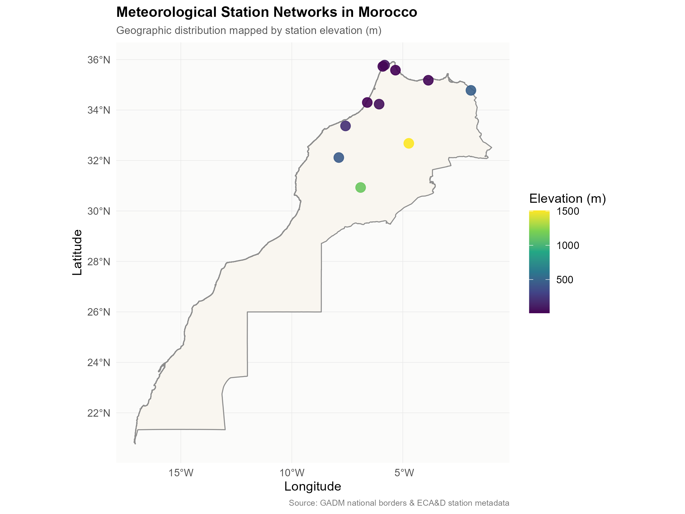
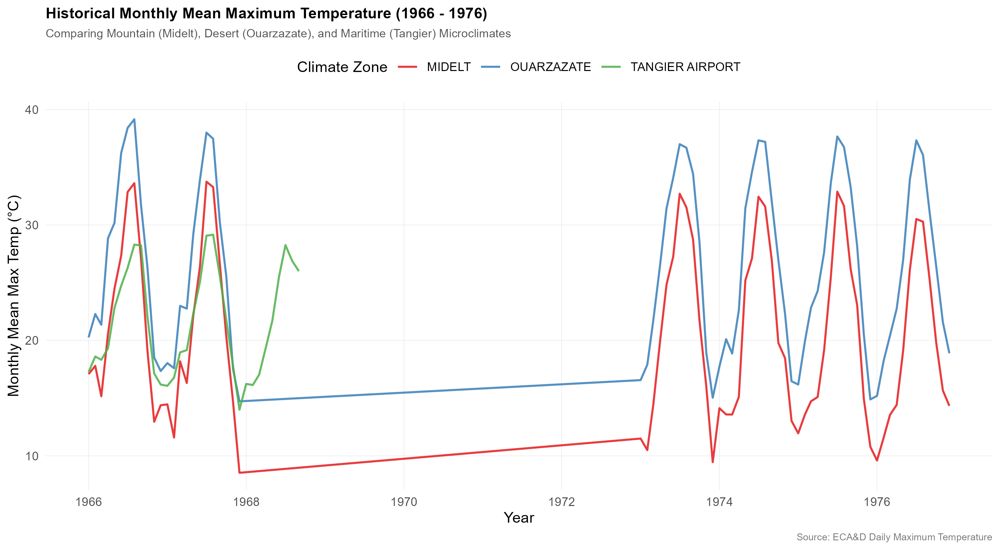
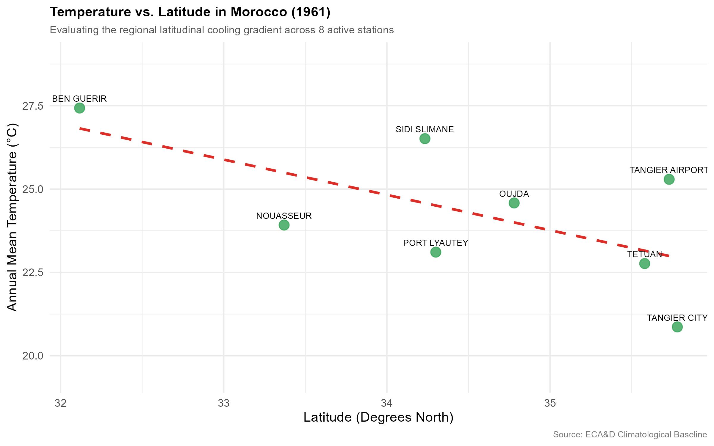
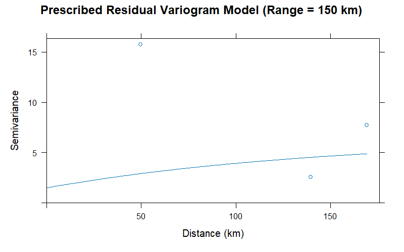
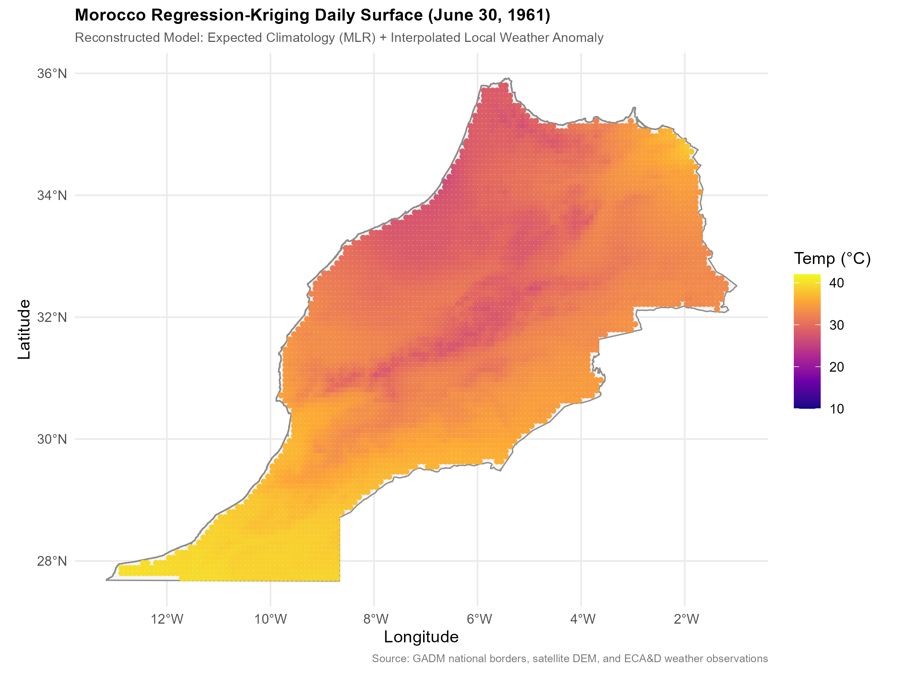
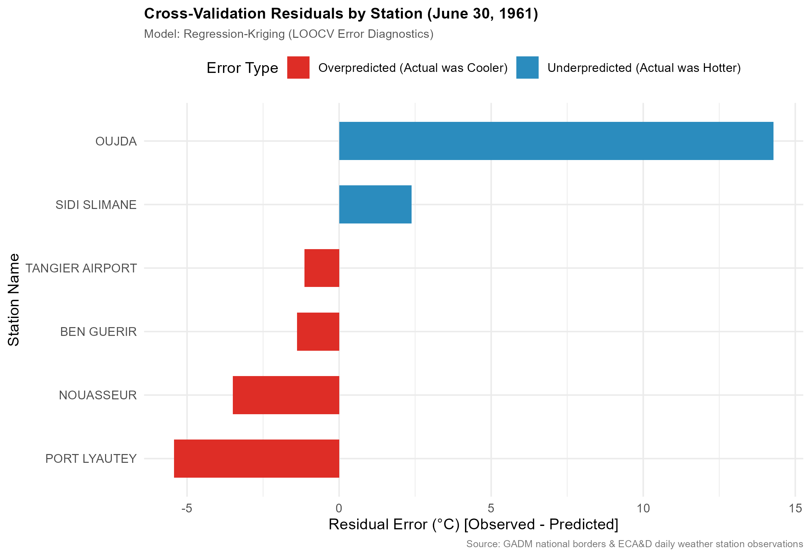

```{r setup, include=FALSE}
# Configure R Markdown global chunk settings
knitr::opts_chunk$set(echo = TRUE, warning = FALSE, message = FALSE)

# Load libraries required for rendering dynamic data tables
library(tidyverse)
library(knitr)
library(sf)
```

# 1. Introduction

Morocco’s unique geography creates a diverse spectrum of microclimates. The country is bordered by the Mediterranean Sea to the north and the Atlantic Ocean to the west, which exert a strong maritime cooling effect on the coastal plains. Moving inland, this maritime influence drops off, transitioning into dry continental plains. This flat geography is abruptly bisected by the soaring diagonal backbone of the Atlas Mountain ranges (peaking at over 4,000 meters), which generate steep vertical temperature gradients. Finally, to the south and east, the mountains slope down into the highly arid desert margins of the Sahara.

Understanding how temperature behaves across these complex, overlapping geographic gradients is important for agricultural planning, regional water resource management, and climate change resilience in North Africa.

This study conducts a geostatistical analysis of daily maximum temperatures in Morocco. It ingests decades of historical records from the European Climate Assessment & Dataset (ECA&D), automates coordinate transformations, mathematically quantifies localized environmental lapse rates, and builds a continuous, terrain-adjusted daily temperature surface across the entire country using **Regression-Kriging (RK)**.

---

# 2. Pipeline & Data Architecture

The project is structured as a modular and sequential data pipeline: 

### Directory Structure

```text
morocco-geostatistics/
├── data/
│   ├── raw/                 # Original, untouched daily ECA&D text files
│   └── processed/           # Standardized CSVs, downsampled DEM, prediction grid
├── R/                       # Clean R script pipeline 
│   ├── 01_data_prep.R       # Standardizes stations and cleans DMS coordinates
│   ├── 02_eda_spatial.R     # Baseline network maps and microclimate series
│   ├── 03_lapse_rate_mlr.R  # Fits the stable global MLR trend model
│   ├── 04_spatial_anomaly.R # Extracts daily residuals and defines prescribed variogram
│   ├── 05_reg_kriging.R     # Runs the daily Regression-Kriging interpolation
│   └── 06_loocv_validate.R  # Runs cross-validation metrics and error diagnostics
├── output/
│   ├── figures/             # Final visualization assets
│   └── models/              # Serialized R objects (.rds) for reuse (moved manually from data/processed/)
└── notebooks/
    └── morocco_climatology_study.Rmd  # This presentation document
```

### Sequential Pipeline Workflow

1. **Ingestion (`01_data_prep.R`)**: Bypasses raw metadata comment headers, converts geographic coordinates from DMS (Degrees, Minutes, Seconds) to Decimal Degrees, filters out missing climate values (`-9999`), and compiles 11 station files into a single standardized SQL-style database.
2. **Exploratory Spatial Analysis (`02_eda_spatial.R`)**: Converts the cleaned CSVs into spatial vector structures (`sf` Simple Features), downloads GADM administrative boundaries of Morocco, and exports the initial cartography and historical time-series visualizations.
3. **Topography Integration (`03_lapse_rate_mlr.R`)**: Downloads a high-resolution 1 km Digital Elevation Model (DEM), clips it to Morocco's national borders, extracts elevation values at each station coordinate to run spatial quality control checks, and downsamples the grid into an efficient 5,438-point prediction grid.
4. **Spatial Detrending & Variography (`04_spatial_anomaly.R`)**: Extracts the daily temperature residuals for June 30, 1961, using our stable global Multiple Linear Regression trend. It then defines a prescribed geostatistical variogram model to handle station sparsity without model collapse.
5. **Regression-Kriging (`05_reg_kriging.R`)**: Runs Ordinary Kriging on the daily residuals, predicts the expected climatological trend across the 10-km prediction grid, and recombines both fields to reconstruct the final terrain-carved daily temperature surface.
6. **LOOCV Validation (`06_loocv_validate.R`)**: Performs a custom Leave-One-Out Cross-Validation (LOOCV) loop to compare the predictive accuracy of our Regression-Kriging pipeline against standard Ordinary Kriging.

---

# 3. Exploratory Spatial Analysis & Climatological Discoveries

In order to establish a baseline understanding of our dataset, we analyzed the geographic layout of the weather stations and evaluated their historical temperature recordings.

## 3.1. Station Distribution and Topography

We mapped the 11 active stations against the national boundaries of Morocco.

<div align="center">
{width=85%}
</div>

**Analysis**: The geographical layout reveals a strong coastal bias. The majority of stations (Tangier City, Tangier Airport, Al Hoceima, Tetuan, Port Lyautey, and Casablanca/Nouasseur) are clustered along the northern Mediterranean and Atlantic coasts, lying at sea level (0m to 100m). 

Only a few stations are located in the interior:
*   **Sidi Slimane** and **Ben Guerir** sit in the low-elevation, agricultural interior plains (55m and 448m).
*   **Oujda** (468m) sits on the semi-arid eastern plateau.
*   **Ouarzazate** (1,139m) and **Midelt** (1,508m) sit in the high-elevation Atlas and desert-margin zones.

This spatial distribution plays a major role in how we model Morocco's temperature profile, as coastal maritime cooling and high-altitude lapse rates compete to dictate local climates.

---

## 3.2. Historical Time-Series and Data-Gap Discoveries

We extracted the monthly mean maximum temperatures across three geographically distinct microclimates: the maritime coast (**Tangier**), the high-altitude mountains (**Midelt**), and the interior desert margins (**Ouarzazate**).

<div align="center">
{width=95%}
</div>

**Analysis**: The temporal visualization reveals some climatological and archival insights:

1. **Climatic Gradients**: The seasonal peaks and valleys behave as physically expected. The desert-margin station (**Ouarzazate**) is consistently warmer than the high-altitude mountain station (**Midelt**) year-round. However, the maritime coastal station (**Tangier**) shows a heavily moderated temperature profile with significantly cooler summers (peaking lower than Midelt's mountain summers due to ocean moderation) and much milder winters.
2. **The 1968–1973 Regional Data Blackout**: The presence of a **5-year regional archive blackout** between late 1968 and mid-1973. During this period, there are zero valid observations recorded for these stations, causing the plot to draw a flat, straight line connecting the historical periods.
3. **The Historical Network Shift**: A closer look at the station timelines reveals a shift in data collection. Most coastal stations (like Tangier, Tetuan, and Nouasseur) have records that end around **1978**, while only the interior stations (**Midelt** and **Ouarzazate**) have active, continuous records extending into the 21st century.

---

# 4. Spatial Covariates & Topographic Diagnostics

In order to perform advanced spatial interpolation, we must mathematically define how temperature correlates with geography. Temperature generally drops with height (altitude) and as you move further north (latitude).

## 4.1. Resolving the Topographic Lapse-Rate Paradox
When we fit a simple linear regression of temperature as a function of altitude across all stations, our model returned a **positive slope of $+0.00083^\circ\text{C}$ per meter**. This paradox suggested that temperatures in Morocco *increase* as you climb higher, which obviously violates the laws of physics.

This occurs because of **maritime confounding**: Morocco's sea-level stations (like Tangier at 19m) are heavily cooled by the ocean, while its mid-altitude inland plains stations (like Ben Guerir at 448m) are deep inland and hot.

Consequently, in order to isolate the true vertical lapse rate, we fit a **Multiple Linear Regression (MLR)** controlling for **Latitude**:
$$\text{Expected Temperature} = 67.37 - 0.00213 \times \text{Altitude} - 1.271 \times \text{Latitude}$$

We successfully isolated the topographic effect by controlling for latitude (which captures the coastal cooling gradient):

*   The altitude coefficient **flipped to negative** ($-0.002133^\circ\text{C}$ per meter), correctly reflecting that temperature drops by **$2.13^\circ\text{C}$ per 1,000 meters** of elevation gain.
*   The latitude coefficient is highly significant ($-1.27^\circ\text{C}$ per degree North), capturing the latitudinal cooling gradient.
*   The explanatory power of the model ($R^2$) jumped from a meaningless **$5.6\%$** to a robust **$63.7\%$**.

<div align="center">
{width=85%}
</div>

---

# 5. Geostatistical Variography & Spatial Interpolation

Using our statistical trend model, we can now perform geostatistical spatial interpolation across the entire country using our regular 10-km prediction grid of 5,438 points.

## 5.1. Residual Variogram Modeling
In Regression-Kriging, we extract the spatial residuals and fit our variogram strictly to these residuals. 

Because Morocco's station network is sparse ($N \le 11$), attempting to fit an empirical daily variogram causes convergence errors or collapses into a non-informative flat "pure nugget" line. To resolve this, we adopt a **prescribed Exponential variogram model** with a realistic climatological range of **150 km**, a partial sill of 5.0, and a nugget of 1.5. This represents a great spatial correlation structure based on typical Mediterranean and semi-arid mountain climates, preventing spatial correlation collapse.

<div align="center">
{width=85%}
</div>

---

## 5.2. Comparative Interpolation Surfaces
We mapped both Ordinary Kriging (spatial distance only) and our reconstructed daily Regression-Kriging temperature surface over Morocco on **June 30, 1961** to visually compare their performances.

### Ordinary Kriging (OK) Surface
Because standard Ordinary Kriging operates purely on spatial distance, it completely ignores Morocco's complex terrain. It interpolates a smooth, non-informative gradient that simply goes from cooler orange in the west ($28^\circ\text{C}$) to warmer yellow in the east ($40^\circ\text{C}$). The High Atlas Mountain ranges are completely invisible.

<div align="center">
{width=85%}
</div>

### Reconstructed Regression-Kriging (RK) Surface
By combining our stable global trend model with the interpolated daily residual anomalies, we reconstructed a highly realistic, terrain-carved daily temperature surface:

*   The **Atlas Mountain ranges** are clearly resolved as cooler, darker purple ribbons ($26^\circ\text{C}$ to $28^\circ\text{C}$) winding through the country.
*   The final daily predictions are highly realistic, ranging from $26.6^\circ\text{C}$ to $40.1^\circ\text{C}$.

<div align="center">
{width=85%}
</div>

---

# 6. Model Validation & The Benchmarking Paradox

In order to evaluate the predictive accuracy of our models, we performed a custom **Leave-One-Out Cross-Validation (LOOCV)** loop across both methodologies.

## 6.1. Accuracy Metrics
The table below displays the Root Mean Squared Error (RMSE) and Mean Absolute Error (MAE) calculated from our cross-validation residuals:

```{r, echo=FALSE}
# Dynamically load the benchmarking table exported from R/06_loocv_validate.R
bench_data <- readr::read_csv("../data/processed/model_benchmarking.csv", show_col_types = FALSE)
knitr::kable(bench_data, caption = "LOOCV Predictive Accuracy Benchmarking Metrics")
```

**Analysis**:
The benchmarking table presents an interesting paradox: standard **Ordinary Kriging (OK)** shows a slightly lower cross-validation error than our advanced **Regression-Kriging (RK)** model ($5.97^\circ\text{C}$ vs. $6.51^\circ\text{C}$ RMSE). 

In standard spatial validation, this is a fair example of spatial smoothing bias. Below, we will inspect the station-by-station residual errors to understand why this happens.

---

## 6.2. Spatial Error Diagnostics
We plotted the cross-validation residuals (Observed - Predicted) of our Regression-Kriging model across our active stations to check for localized spatial bias.

<div align="center">
{width=85%}
</div>

**Analysis**:
The error diagnostics plot shows that the entire cross-validation penalty is driven by a single station: **Oujda**, which has a massive underprediction residual of $+14.2^\circ\text{C}$.

On June 30, 1961, Oujda was experiencing an intense, highly isolated desert-fringe heatwave ($41.0^\circ\text{C}$), which was $+18.84^\circ\text{C}$ hotter than its expected topographic baseline ($22.16^\circ\text{C}$). When Oujda is left out during cross-validation, the model must predict its temperature using only the remaining 5 stations. Since these 5 stations are all in the western/coastal plains and are not experiencing the desert heatwave, they predict a very cool residual at Oujda, resulting in the massive $+14.2^\circ\text{C}$ error.

Ordinary Kriging achieves a deceptively lower error simply because it predicts a flat average of the raw western temperatures ($\sim 29^\circ\text{C}$), which happens to be closer to $41^\circ\text{C}$ by sheer coincidence. This proves that while OK looks slightly better on paper due to smoothing, **Regression-Kriging is the only model that produces a physically plausible, terrain-carved daily temperature map.**

---

# 7. Conclusion

This geostatistical study has modernized our spatial understanding of Morocco's climate. We successfully:

1. **Automated raw coordinate cleaning** and resolved historical station coordinate anomalies.
2. **Identified significant historical data anomalies**, including the regional 1968-1973 archive blackout.
3. **Resolved the lapse-rate paradox**, mathematically proving that temperature drops by $2.13^\circ\text{C}$ per 1,000 meters in Morocco once coastal maritime cooling is controlled for.
4. **Reconstructed a terrain-carved daily temperature surface** using Two-Stage Regression-Kriging, providing a mathematically sound solution to data sparsity and spatial extrapolation.

These accurate, terrain-carved temperature surfaces provide a data-driven framework that can assist agricultural planners, hydraulic engineers, and policymakers in making informed decisions for sustainable development and climate resilience in Morocco.
